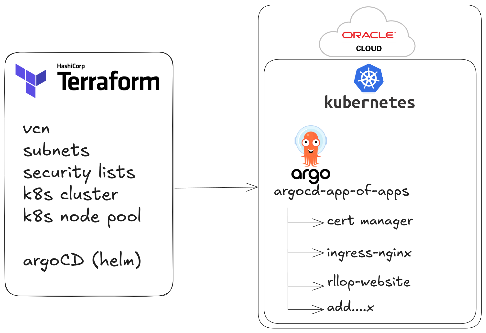

# How I am hosting this website

## Introduction

I'm not primarily a frontend developer, so this website isn't the most impressive. Its purpose is to serve as a personal CV and a space to document my DevOps projects. The site is created using [Docusaurus](https://docusaurus.io/). Allowing ease of use to document projects and future endeavors using markdown.

What is perhaps more interesting is the **site's hosting and CI/CD pipeline**, though admittedly overkill for a static site. This was a practice project and a showcase of my skills. This document will explore this setup in detail.

The setup includes an **always free Kubernetes cluster** using [Oracle Cloud](https://www.oracle.com/es/cloud/), **Containerization** of the website, **CI/CD using GitHub Actions**, **CD using [ArgoCD](https://argo-cd.readthedocs.io/en/stable/)** and **Helm**. So keep reading if you are interested.

## The webpage

The site is stored in this [Github repository](https://github.com/ricardllop/rllopsite), it is created using [Docusaurus](https://docusaurus.io/docs), a React-based static-site generator for fast, interactive sites, ideal for documentation, blogs, or personal projects.

## The Kubernetes cluster

The Kubernetes cluster is hosted on [Oracle Cloud](https://www.oracle.com/es/cloud/), and it is declared using Terraform, the code is public in this [Github repository](https://github.com/ricardllop/tf-oci-cluster-infra).

The Terraform code is declaring all the necessary infrastructure resources on Oracle Cloud. (Only using **always free** resources). It is creating:

- 1 VCN
- 2 subnets (1 public, 1 private)
- 1 OKE (Oracle) Kubernetes cluster
- 1 Node pool for the cluster. Formed by 2 instances of VM.Standard.A1.Flex 2 OCPUs and 12 GB each, making use of the limit [Always free compute of Oracle Cloud](https://docs.oracle.com/en-us/iaas/Content/FreeTier/freetier_topic-Always_Free_Resources.htm#compute).

It also has a 2nd part to deploy [ArgoCD](https://argo-cd.readthedocs.io/en/stable/) using Terraform. ArgoCD along with the [app of apps pattern](ttps://argo-cd.readthedocs.io/en/stable/operator-manual/cluster-bootstrapping/#app-of-apps-pattern) are then used to deploy the rest of needed resources to the Kubernetes cluster.

The [README.md](https://github.com/ricardllop/tf-oci-cluster-infra/blob/main/README.md) has much more detailed information on how to set it up if you want to replicate this.

## Helm charts & App of Apps

Once the Kubernetes cluster is set, and ArgoCD is deployed using Terraform. Using ArgoCD and GIT OPS ([app of apps pattern](ttps://argo-cd.readthedocs.io/en/stable/operator-manual/cluster-bootstrapping/#app-of-apps-pattern)) we can deploy anything else that is desired to the Kubernetes cluster. For now, using Helm I deployed the Helm charts stored in this [Github repository](https://github.com/ricardllop/platform-charts).

For now I only have cert-manager & clusterissuer, ingress-nginx and my site as an nginx deployment Helm chart. More apps can simply be added to the [ArgoCD app of apps Github repository](https://github.com/ricardllop/argocd-app-of-apps/blob/main/values.yaml), and Argo will automatically sync and deploy any new app.

## Setting up the CI for the site

To achieve easy continous integration for the site, and being able to generate automatically new container versions with any commit I push to github. I used [Github Actions](https://github.com/features/actions).

The configuration is done in the code repository itself. In the file: [.github/workflows/build-deploy-docker.yml ](https://github.com/ricardllop/rllopsite/blob/main/.github/workflows/build-deploy-docker.yml).

You can see this Github workflow will actually do both CI and CD (along with ArgoCD). I will explain the CI here and the CD on the section below.

This GitHub Action workflow builds and pushes a Docker image to Docker Hub when changes are pushed to the `main` branch.

1. Logs in to Docker Hub using credentials stored in Github secrets
2. Installs and configures QEMU, enabling cross-platform builds.
3. Configures Docker Buildx, a CLI tool for advanced Docker image building features.
4. Creates a unique tag for the Docker image using the current date and time in the format `ga-YYYY.MM.DD-HHMM`
5. Builds the Docker image for the `linux/arm64` platform. Pushes the built image to Docker Hub. Tags the image using the timestamp tag generated in the previous step

With this steps, we have the CI configuration completed, and any commit to the main branch will trigger a new docker image tag build. That we could (if desired) deploy manually to the cluster. But we have gone further and set up a CD part.

## Setting up the CD for the site

To achieve easy continous deployment, apart from having ArgoCD on autosync configuration, there is an additional part on the GitHub Action workflow that is triggered on push to the `main` branch. Therefore on each build and push to docker registry the following actions will also execute:

1. Checks out the Helm charts remote repository `helm-charts` directory `rllopsite-chart` to the local `rllopsite-chart` directory.
2. Uses yq, a command-line YAML processor, to update the image tag in the `rllopsite-chart/values.yaml` file with the new Docker image tag.
3. Configures Git with a default username and email for committing changes.
4. Commits the updated `values.yaml` file (with the new image tag) to the repository.
5. Pushes the commit to the `main` branch.

Then ArgoCD will detect those changes on periodical refresh, and will sync (as autosync is activated) deploying the new built container to the cluster.

## Conclusions

This project demonstrates a robust, full-stack DevOps pipeline, showcasing skills in infrastructure automation, containerization, CI/CD, and GitOps. The use of Oracle Cloud’s free-tier Kubernetes cluster, Terraform for infrastructure provisioning, and ArgoCD for managing deployments with the app-of-apps pattern provides a solid foundation for scaling applications.

The CI/CD pipeline, powered by GitHub Actions, automates the build and deployment of the website, with updates quickly reflected in the live environment through ArgoCD's autosync feature.

In conclusion, this setup might be overkill for a static website, but it serves as a perfect practice project to showcase my knowledge with modern DevOps tools and methodologies. The flexibility and scalability of the architecture ensure that the system can easily accommodate future enhancements, making it a valuable foundation for future projects and experiments.
